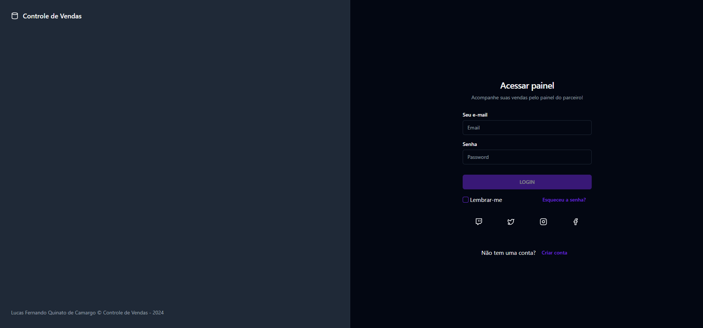
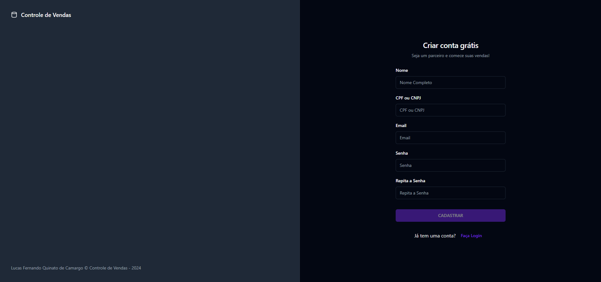
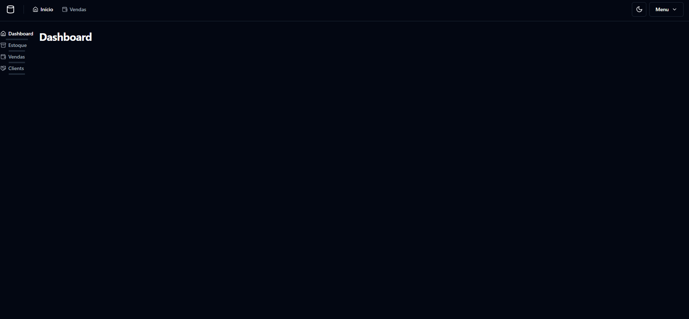

# Sistema de Gestão de Estoque e Vendas

## Descrição

Este sistema fornece uma solução completa e acessível para gestão de estoque e vendas, especialmente projetado para atender às necessidades de pequenas e médias empresas. Ele facilita o controle de inventário, gestão de vendas, e administração de clientes sem a necessidade de emissão de nota fiscal.

## Funcionalidades

### Cadastro de Produtos
- **Cadastro Completo:** Inclui detalhes como nome, descrição, categoria, preço, código de barras, e fotos.
- **Gerenciamento:** Ferramentas para atualização rápida e remoção de produtos descontinuados.

### Controle de Estoque
- **Monitoramento em Tempo Real:** Atualizações instantâneas do estoque conforme vendas e recebimentos.
- **Análise de Estoque:** Gráficos e relatórios detalhados sobre a movimentação de produtos, identificando tendências e necessidades de reposição.

### Gestão de Vendas
- **Processamento de Vendas:** Interface intuitiva para rápido registro de vendas, com suporte a múltiplos métodos de pagamento.
- **Relatórios de Vendas:** Análises detalhadas das vendas, permitindo visualizar performances por período, categoria de produto, ou vendedor.

### Cadastro de Clientes
- **Informações Completas:** Registra detalhes como nome, contato, endereço, e histórico de interações.
- **Fidelização de Clientes:** Funcionalidades para programas de fidelidade, oferecendo descontos e promoções baseados no histórico de compras.

### Controle Financeiro
- **Gestão de Recebíveis:** Sistema para acompanhar vendas a prazo, com alertas para pagamentos atrasados.
- **Análise Financeira:** Ferramentas para análise de fluxo de caixa e rentabilidade, essenciais para a tomada de decisões estratégicas.

## Licença

Este código é propriedade exclusiva de Lucas Fernando Quinato de Camargo e não pode ser usado, modificado ou distribuído sem permissão expressa. Veja o arquivo [LICENSE](LICENSE) para detalhes completos.

